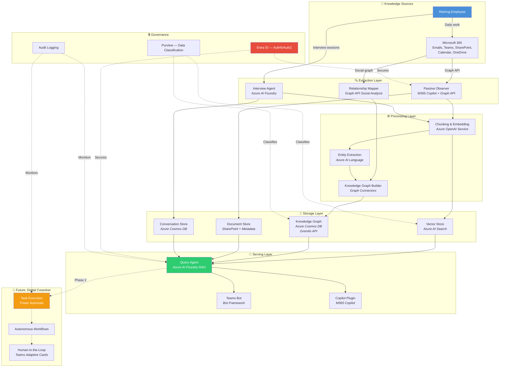

# Knowledge Transfer Agent

> An AI agent architecture for capturing institutional knowledge from retiring employees — built on the Microsoft stack.

## The Problem

When long-tenured employees retire, organizations lose decades of critical institutional knowledge:

- **Tacit knowledge** — Why decisions were made, unwritten rules, "the way things actually work"
- **Explicit knowledge** — Documents, runbooks, configurations, code ownership
- **Relationship context** — Who to call, vendor contacts, escalation paths, political dynamics

Traditional knowledge transfer (shadowing, exit interviews, wiki dumps) captures only a fraction. The rest walks out the door.

## The Solution

An AI-powered agent system that:

1. **Passively observes** the retiree's digital work patterns via Microsoft 365
2. **Conducts structured interviews** with adaptive questioning to fill knowledge gaps
3. **Builds a queryable knowledge base** that colleagues can ask questions to
4. **Evolves into a "digital coworker"** that can autonomously execute tasks the retiree used to handle

## Architecture Overview

## Tech Stack

| Layer | Technology | Purpose |
|-------|-----------|---------|
| **Observation** | Microsoft Graph API, M365 Copilot | Monitor work patterns, extract from emails/docs/meetings |
| **Interviews** | Azure AI Foundry | Orchestrate adaptive interview sessions |
| **Embeddings** | Azure OpenAI Service | Generate text embeddings for semantic search |
| **Entity Extraction** | Azure AI Language | Named entity recognition (people, processes, systems) |
| **Vector Search** | Azure AI Search | Hybrid vector + keyword search over knowledge base |
| **Knowledge Graph** | Azure Cosmos DB (Gremlin API) | Relationship data: people → processes → systems → decisions |
| **Documents** | SharePoint / OneDrive | Original artifacts with enriched metadata |
| **Agent Interface** | Microsoft Bot Framework, Teams | Natural language access for colleagues |
| **Copilot Integration** | M365 Copilot Plugins | Contextual knowledge surfacing in daily work |
| **Task Automation** | Power Automate | Autonomous task execution (future phase) |
| **Identity** | Microsoft Entra ID | Authentication and role-based access control |
| **Compliance** | Microsoft Purview | Data classification and sensitivity labeling |

## Documentation

| Document | Description |
|----------|-------------|
| [Architecture Overview](docs/architecture-overview.md) | Detailed multi-level architecture with C4-style diagrams |
| [Extraction Layer](docs/components/extraction-layer.md) | Passive observer + interview agent design |
| [Processing Layer](docs/components/processing-layer.md) | Chunking, embedding, entity extraction pipeline |
| [Storage Layer](docs/components/storage-layer.md) | Vector store, knowledge graph, document store |
| [Serving Layer](docs/components/serving-layer.md) | Query agent, Teams bot, Copilot plugin |
| [Digital Coworker](docs/components/digital-coworker.md) | Future autonomous agent capabilities |
| [Data Model](docs/data-model.md) | Entity relationships and schema design |
| [Security & Governance](docs/security-governance.md) | Auth, RBAC, consent, compliance |
| [User Journeys](docs/user-journeys.md) | Retiree, colleague, and admin experiences |
| [ADRs](docs/adr/) | Architecture Decision Records |
| [MVP Plan](mvp-plan/) | Phased implementation plan for building an MVP |

## Key Design Decisions

- **[ADR-001](docs/adr/001-microsoft-stack.md)** — Why the Microsoft stack (vs. AWS/GCP/multi-cloud)
- **[ADR-002](docs/adr/002-knowledge-graph-choice.md)** — Cosmos DB Gremlin vs. Neo4j vs. pure vector approach
- **[ADR-003](docs/adr/003-hybrid-extraction.md)** — Why both passive observation AND structured interviews

## Getting Started

This repository contains architecture documentation and an MVP implementation plan. There is no application code yet — the [MVP Plan](mvp-plan/) provides detailed technical specifications that a development team or coding agent can use to build Phase 1.

### Prerequisites for MVP Development

- Azure subscription with Azure AI Foundry access
- Microsoft 365 tenant with Graph API permissions
- Microsoft Entra ID for identity management
- Node.js 20+ / Python 3.11+ (language TBD in MVP phase)

## Contributing

This is an open architecture proposal. Feedback, suggestions, and contributions are welcome:

1. Open an [issue](https://github.com/jnscnn/knowledge-transfer-agent/issues) to discuss ideas
2. Submit a PR for documentation improvements
3. Star the repo if you find the concept valuable

## License

[MIT](LICENSE)
