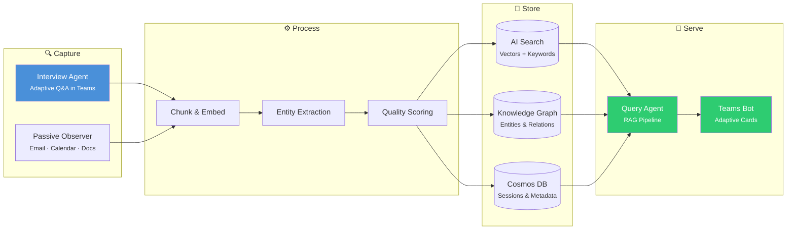
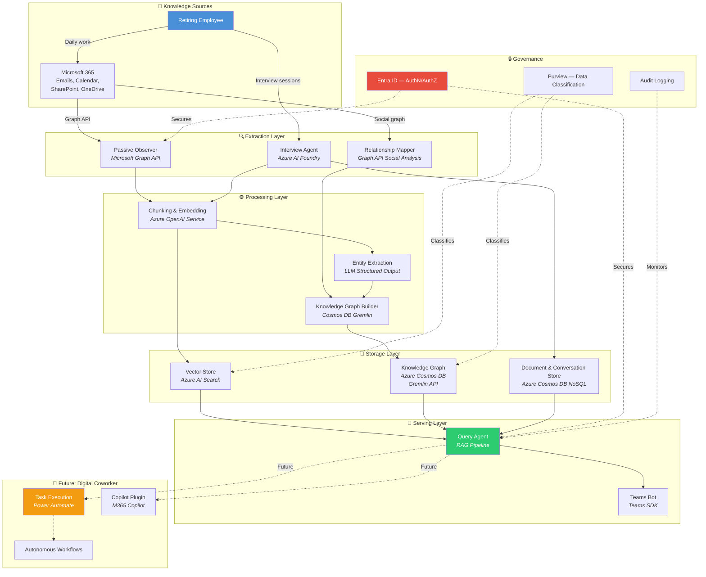

# Knowledge Transfer Agent

> An AI-powered system that captures institutional knowledge from retiring employees and makes it queryable through a Microsoft Teams bot — built on the Microsoft Azure stack.

[](https://opensource.org/licenses/MIT)


## The Problem

When long-tenured employees retire, organizations lose decades of critical institutional knowledge:

- **Tacit knowledge** — Why decisions were made, unwritten rules, "the way things actually work"
- **Explicit knowledge** — Documents, runbooks, configurations, code ownership
- **Relationship context** — Who to call, vendor contacts, escalation paths, political dynamics

Traditional knowledge transfer (shadowing, exit interviews, wiki dumps) captures only a fraction. The rest walks out the door.

## The Solution

An AI-powered agent system that:

1. **Conducts structured interviews** with adaptive questioning to capture knowledge from the retiree via Teams
2. **Passively observes** the retiree's digital work patterns (email, calendar, documents) via Microsoft Graph API
3. **Processes and stores** captured knowledge in a searchable vector store and knowledge graph
4. **Answers colleagues' questions** through a Teams bot using RAG with cited sources and confidence scoring

## How It Works



**The capture → query loop in practice:**

1. **A retiree starts an interview** in Teams → the Interview Agent asks domain-specific questions, adapts follow-ups based on responses, and extracts knowledge chunks
2. **The Passive Observer** monitors the retiree's email, calendar, and document activity via Graph API to identify knowledge domains and gaps
3. **The Processing Pipeline** chunks text, generates embeddings (3072-dim), extracts entities and relationships, scores quality, classifies sensitivity, and indexes everything across three stores
4. **A colleague asks a question** in Teams → the Query Agent rewrites the query, retrieves from vector search + knowledge graph in parallel, reranks with Reciprocal Rank Fusion, generates a cited answer with confidence scoring, and returns it as an Adaptive Card

## Teams Bot Commands

Once deployed, the bot responds to these commands in Teams:

| Command | What it does |
|---------|-------------|
| *Just ask a question* | Searches the knowledge base and returns an answer with sources, confidence, and follow-up suggestions |
| `/interview start` | Begins a structured knowledge capture session with the Interview Agent |
| `/interview end` | Ends the current interview and shows a summary (chunks captured, coverage delta) |
| `/progress` | Shows a dashboard with knowledge coverage per domain |
| `/help` | Lists available commands |

**Query responses** include:
- 📝 Cited answer with `[Source N]` references
- 🟢🟡🔴 Confidence indicator (High / Medium / Low)
- 📎 Expandable source list (interview transcripts, email observations, documents)
- 💡 Follow-up question suggestions
- 👍👎 Feedback buttons to improve future results

## Architecture Overview



## Tech Stack

| Layer | Technology | Purpose |
|-------|-----------|---------|
| **Runtime** | Node.js 20+ / TypeScript (strict) | Application code, Azure SDK support |
| **Interviews** | Azure AI Foundry (`@azure/ai-projects`) | Orchestrate adaptive interview sessions with function tools |
| **Observation** | Microsoft Graph API | Monitor email, calendar, and document patterns |
| **LLM** | Azure OpenAI (configurable model) | Interview agent, query agent, entity extraction, domain classification |
| **Embeddings** | Azure OpenAI text-embedding-3-large | 3072-dimensional vectors for semantic search |
| **Vector Search** | Azure AI Search (S1) | Hybrid vector + keyword search with semantic reranking |
| **Knowledge Graph** | Azure Cosmos DB (Gremlin API) | Entity relationships: people → processes → systems → decisions |
| **Document Store** | Azure Cosmos DB (NoSQL API) | Interview sessions, knowledge chunks, observations, feedback |
| **Bot Interface** | Teams SDK (`@microsoft/teams-ai`) | Teams bot with Adaptive Cards for query and interview UX |
| **Event Processing** | Azure Functions (Node.js 20) | Blob triggers, Graph webhooks, scheduled tasks |
| **Infrastructure** | Bicep (Azure IaC) | 12 modular templates for all Azure resources |
| **Identity** | Microsoft Entra ID | Authentication, Managed Identity, role-based access |
| **Monitoring** | Application Insights | Structured logging and telemetry |

> **Note:** Cosmos DB requires **two separate accounts** because the NoSQL and Gremlin APIs cannot coexist on a single account. The Bicep templates handle this automatically.

## Project Structure

```
knowledge-transfer-agent/
├── src/
│   ├── shared/              # Types, config (Zod), errors, retry, logging
│   ├── storage/             # Cosmos DB NoSQL & Gremlin clients, AI Search client
│   ├── pipeline/            # Chunking, embedding, entity extraction, quality scoring, indexing
│   ├── agents/
│   │   ├── interview/       # Interview agent, session management, question generation, prompts
│   │   └── query/           # RAG pipeline: intent → rewrite → retrieve → rerank → generate → guardrails
│   ├── graph/               # Graph API client, email/calendar/document analyzers, gap identification
│   ├── bot/                 # Teams bot, Adaptive Cards, conversation handlers, app manifest
│   └── index.ts             # Express server entry point (POST /api/messages, GET /api/health)
│
├── functions/               # Azure Functions (event-driven processing)
│   └── src/functions/       # Blob triggers, Graph webhooks, timer triggers
│
├── infra/                   # Bicep infrastructure-as-code
│   ├── main.bicep           # Orchestrator deploying 10 modules
│   ├── modules/             # Individual resource templates (11 modules)
│   └── parameters/          # Environment-specific parameters
│
├── tests/                   # Vitest test suite (81 tests)
│   ├── unit/                # Chunking, scoring, reranking, guardrails, cards, retry
│   ├── integration/         # Full pipeline and query pipeline with mocked Azure services
│   └── fixtures/            # Sample interview transcripts and knowledge data
│
├── docs/                    # Architecture documentation (full vision)
├── mvp-plan/                # Phased MVP implementation specifications
├── package.json             # Dependencies and scripts
├── tsconfig.json            # TypeScript strict, ES2022, NodeNext
└── vitest.config.ts         # Test configuration
```

## Getting Started

### Prerequisites

- **Node.js 20+** and npm
- **Azure subscription** — see [cost estimate](#azure-infrastructure) below
- **Azure CLI** — for deploying infrastructure (`az` command)
- **Microsoft 365 tenant** — for Teams bot testing and Graph API access
- **Entra ID app registrations** — two apps needed (bot + pipeline), see below

### 1. Clone and install

```bash
git clone https://github.com/jnscnn/knowledge-transfer-agent.git
cd knowledge-transfer-agent
npm install
```

### 2. Deploy Azure infrastructure

The Bicep templates provision all required Azure resources:

```bash
# Create resource group
az group create --name kt-agent-rg --location eastus2

# Deploy all resources (takes ~10 minutes)
az deployment group create \
  --resource-group kt-agent-rg \
  --template-file infra/main.bicep \
  --parameters infra/parameters/dev.bicepparam
```

### 3. Configure environment

```bash
cp .env.example .env
```

Fill in the values from the deployment outputs. Key variables:

| Variable | Where to find it |
|----------|-----------------|
| `AZURE_OPENAI_ENDPOINT` | Azure Portal → OpenAI resource → Keys and Endpoint |
| `AZURE_OPENAI_CHAT_DEPLOYMENT` | Name of your chat model deployment (e.g., `gpt-4o`, `gpt-4.1`) |
| `AZURE_OPENAI_AUXILIARY_DEPLOYMENT` | Optional: cheaper model for entity extraction (defaults to chat model) |
| `COSMOS_NOSQL_ENDPOINT` | Azure Portal → Cosmos DB (NoSQL) → Keys |
| `COSMOS_GREMLIN_ENDPOINT` | Azure Portal → Cosmos DB (Gremlin) → Keys |
| `AZURE_SEARCH_ENDPOINT` | Azure Portal → AI Search → Overview |
| `BOT_ID` / `BOT_PASSWORD` | Entra ID → App registrations → kt-agent-bot |
| `GRAPH_CLIENT_ID` / `GRAPH_TENANT_ID` | Entra ID → App registrations → kt-agent-pipeline |

### 4. Initialize storage

```bash
# Create the AI Search index (vector + semantic configuration)
npm run setup:search-index

# Create Cosmos DB database and containers
npm run setup:cosmos
```

### 5. Run

```bash
# Development (hot reload)
npm run dev

# Production
npm run build && npm start
```

The bot server starts on port 3978. Use the [Bot Framework Emulator](https://github.com/microsoft/BotFramework-Emulator) for local testing, or deploy to Azure and register in Teams.

### 6. Test

```bash
npm test              # Run all 81 tests
npm run test:watch    # Watch mode
npm run test:coverage # With coverage report
```

## Azure Infrastructure

The `infra/` directory contains 12 modular Bicep templates that deploy everything needed:

| Resource | SKU | Purpose |
|----------|-----|---------|
| Azure OpenAI | S0 (Standard) | Chat model (30K TPM) + embedding model (120K TPM) |
| Azure AI Search | S1 Standard | Hybrid vector + keyword search with semantic reranking |
| Cosmos DB (NoSQL) | Serverless | Interview sessions, knowledge chunks, observations, feedback |
| Cosmos DB (Gremlin) | Serverless | Knowledge graph (entities and relationships) |
| Azure Functions | Consumption | Event-driven processing (Graph webhooks, timers) |
| Azure Bot Service | F0 (Free) | Teams bot channel registration |
| Azure AI Foundry | Hub + Project | Agent orchestration framework |
| Key Vault | Standard | Secrets management |
| Application Insights | Pay-as-you-go | Monitoring and telemetry |

**Estimated cost: ~$450–750/month** for a dev/pilot environment (mostly AI Search S1 at ~$250 and Azure OpenAI usage).

## Model Configuration

The architecture is **model-agnostic** — you can swap the chat and embedding models via environment variables without changing code. The Bicep templates also accept model parameters.

### Two deployment tiers

| Tier | Env var | Used for | Default |
|------|---------|----------|---------|
| **Chat** | `AZURE_OPENAI_CHAT_DEPLOYMENT` | Interviews, query answers, complex reasoning | `gpt-4o` |
| **Auxiliary** | `AZURE_OPENAI_AUXILIARY_DEPLOYMENT` | Entity extraction, sensitivity classification, domain classification | Same as chat |
| **Embedding** | `AZURE_OPENAI_EMBEDDING_DEPLOYMENT` | Vector embeddings (set `AZURE_OPENAI_EMBEDDING_DIMENSIONS` too) | `text-embedding-3-large` (3072 dims) |

Split the auxiliary tier to a cheaper model (e.g., `gpt-4o-mini`) for cost optimization — bulk extraction tasks don't need the same model quality as interactive conversations.

### Swapping models

```bash
# Use GPT-4.1 for conversations, GPT-4o-mini for bulk extraction
AZURE_OPENAI_CHAT_DEPLOYMENT=gpt-4.1
AZURE_OPENAI_AUXILIARY_DEPLOYMENT=gpt-4o-mini

# Use a smaller embedding model (update dimensions accordingly)
AZURE_OPENAI_EMBEDDING_DEPLOYMENT=text-embedding-3-small
AZURE_OPENAI_EMBEDDING_DIMENSIONS=1536
```

To deploy with a different model in Bicep:

```bash
az deployment group create \
  --resource-group kt-agent-rg \
  --template-file infra/main.bicep \
  --parameters infra/parameters/dev.bicepparam \
  --parameters chatModelName=gpt-4.1 chatModelVersion=2025-04-14
```

## Entra ID App Registrations

You need two app registrations in Microsoft Entra ID:

**1. `kt-agent-bot`** — For the Teams bot
- Type: Multi-tenant
- Permissions (delegated): `User.Read`, `Chat.ReadWrite`, `ChannelMessage.Send`
- Create a client secret → use as `BOT_PASSWORD`

**2. `kt-agent-pipeline`** — For the data pipeline (Graph API observation)
- Type: Single-tenant
- Permissions (application): `Mail.Read`, `Calendars.Read`, `Sites.Read.All`, `Files.Read.All`, `People.Read.All`, `User.Read.All`
- Requires **admin consent** from a tenant administrator
- Create a client secret → use as `GRAPH_CLIENT_SECRET`

## Documentation

The `docs/` directory contains the full architecture vision. The MVP code implements a working subset of this design.

| Document | Description |
|----------|-------------|
| [Architecture Overview](docs/architecture-overview.md) | Detailed multi-level architecture with C4-style diagrams |
| [Extraction Layer](docs/components/extraction-layer.md) | Passive observer + interview agent design |
| [Processing Layer](docs/components/processing-layer.md) | Chunking, embedding, entity extraction pipeline |
| [Storage Layer](docs/components/storage-layer.md) | Vector store, knowledge graph, document store |
| [Serving Layer](docs/components/serving-layer.md) | Query agent, Teams bot, Copilot plugin |
| [Digital Coworker](docs/components/digital-coworker.md) | Future autonomous agent capabilities |
| [Data Model](docs/data-model.md) | Entity relationships and schema design |
| [Security & Governance](docs/security-governance.md) | Auth, RBAC, consent, compliance |
| [User Journeys](docs/user-journeys.md) | Retiree, colleague, and admin experiences |
| [Feasibility Review](docs/feasibility-review.md) | Technical feasibility review with identified issues and fixes |
| [ADRs](docs/adr/) | Architecture Decision Records |
| [MVP Plan](mvp-plan/) | Phased implementation plan with detailed technical specifications |

## Key Design Decisions

- **[ADR-001](docs/adr/001-microsoft-stack.md)** — Why the Microsoft stack (vs. AWS/GCP/multi-cloud)
- **[ADR-002](docs/adr/002-knowledge-graph-choice.md)** — Cosmos DB Gremlin vs. Neo4j vs. pure vector approach
- **[ADR-003](docs/adr/003-hybrid-extraction.md)** — Why both passive observation AND structured interviews

## MVP Scope

### ✅ Included in MVP

- Interview Agent — structured knowledge capture via Teams with adaptive questioning
- Passive Observer — email, calendar, and document pattern analysis via Graph API
- Processing Pipeline — chunking, embedding, entity extraction, quality scoring, indexing
- Knowledge Storage — Azure AI Search (vectors) + Cosmos DB Gremlin (graph) + Cosmos DB NoSQL (documents)
- Query Agent — RAG pipeline with hybrid search, reranking, cited answers, confidence scoring
- Teams Bot — Adaptive Cards with sources, follow-ups, and feedback collection
- Infrastructure as Code — full Bicep templates for all Azure resources
- Consent framework — per-scope opt-in before data collection

### ❌ Deferred to future phases

- **M365 Copilot Plugin** — contextual knowledge surfacing in Copilot
- **Digital Coworker** — autonomous task execution via Power Automate
- **Teams Chat observation** — requires `Chat.Read.All` (protected API needing Microsoft approval); MVP uses email + calendar + documents only
- **Full relationship mapper** — advanced social graph analysis
- **Admin dashboard** — web-based management UI
- **Multi-tenant deployment** — currently designed for single-tenant pilot

## Contributing

Feedback, suggestions, and contributions are welcome:

1. Open an [issue](https://github.com/jnscnn/knowledge-transfer-agent/issues) to discuss ideas
2. Submit a PR for improvements
3. Star the repo if you find the concept valuable

## License

[MIT](LICENSE)
