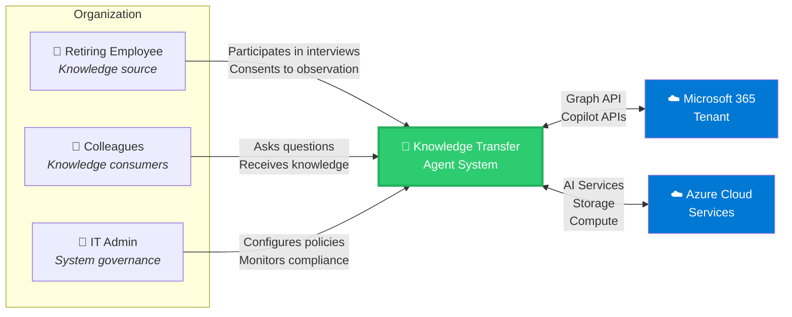
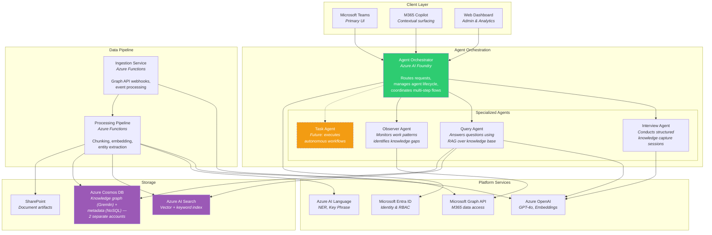
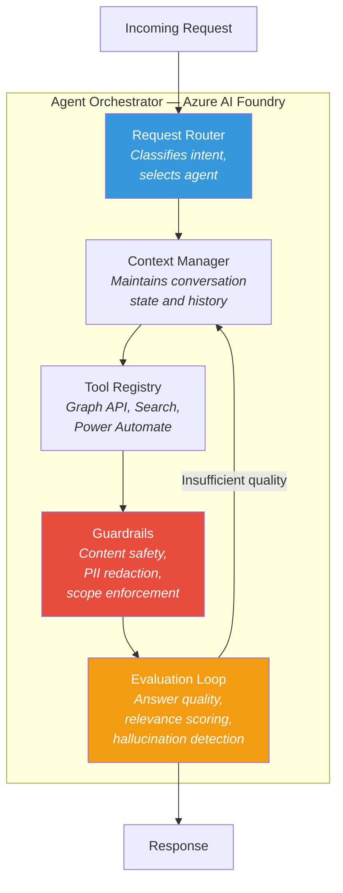
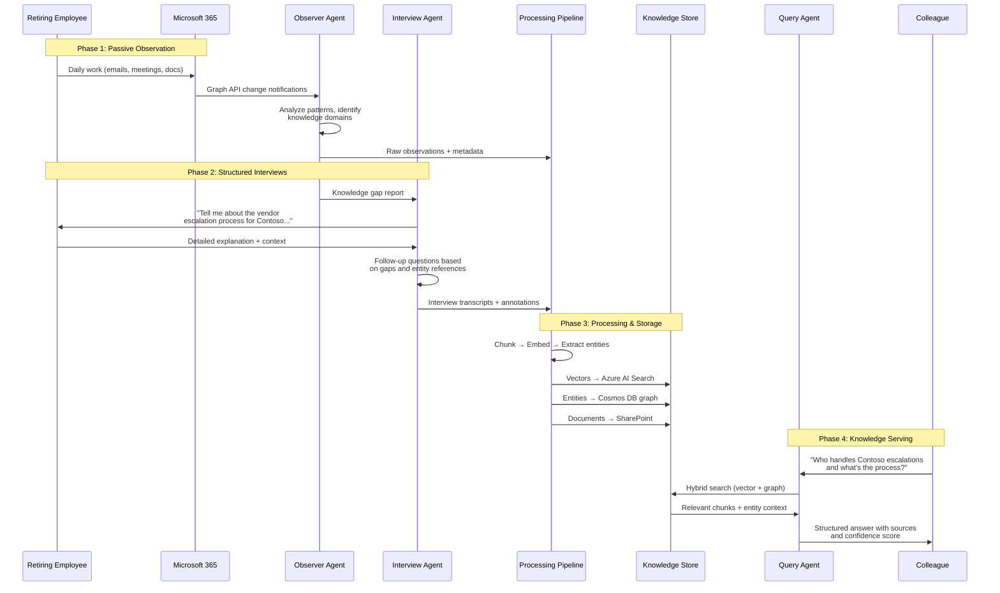
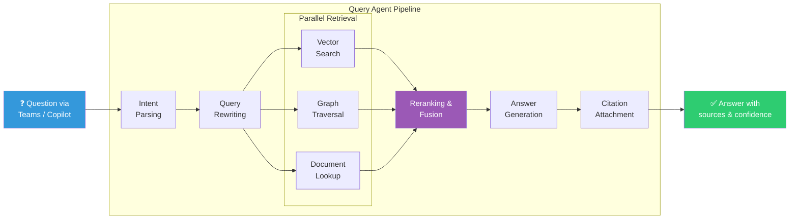
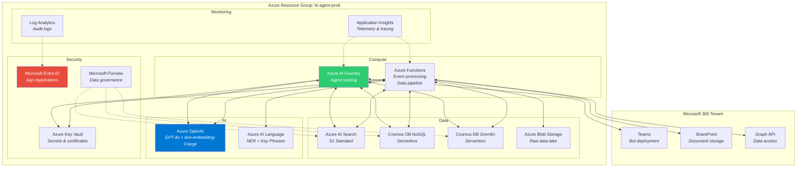
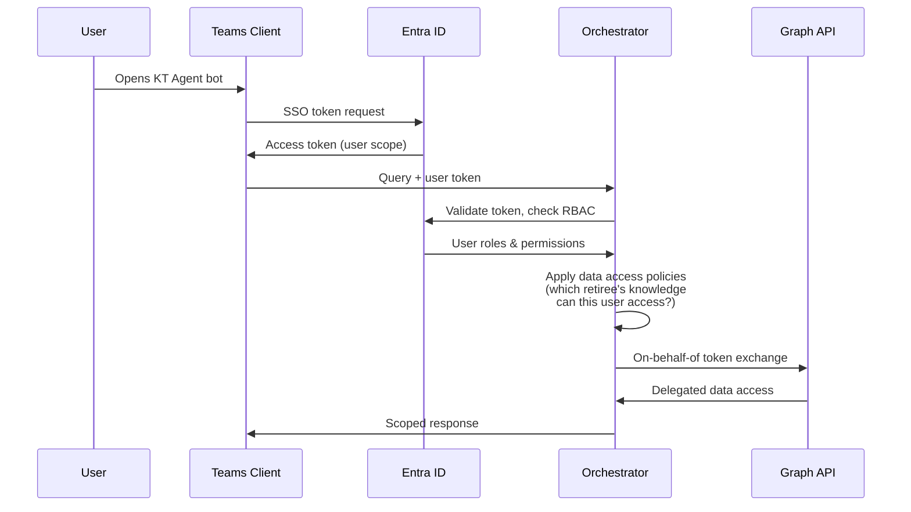

# Architecture Overview

This document provides a detailed, multi-level view of the Knowledge Transfer Agent architecture. It follows a C4-style approach: System Context → Container → Component.

## System Context

The Knowledge Transfer Agent operates within an organization's Microsoft 365 ecosystem, interacting with retiring employees, their colleagues, and IT administrators.

## Container Diagram

Breaking the system into its major runtime containers:

## Component Detail: Agent Orchestrator

The orchestrator is the brain of the system. It routes incoming requests to specialized agents and manages multi-step workflows.

## Data Flow: Knowledge Capture

End-to-end flow from knowledge source to queryable knowledge base:

## Data Flow: Knowledge Query

How a colleague's question gets answered:

## Deployment Architecture

## Cross-Cutting Concerns

### Authentication & Authorization Flow

### Key Architectural Principles

1. **Privacy by Design** — The retiree explicitly consents to observation scope; all data is classified via Purview
2. **Least Privilege** — Each component has minimal Graph API permissions; data access is role-scoped
3. **Auditability** — Every agent action is logged; answers include source attribution
4. **Graceful Degradation** — If a component fails, the agent returns partial results with confidence indicators
5. **Human-in-the-Loop** — High-stakes actions (especially in the digital coworker phase) require explicit approval
