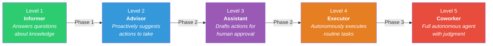
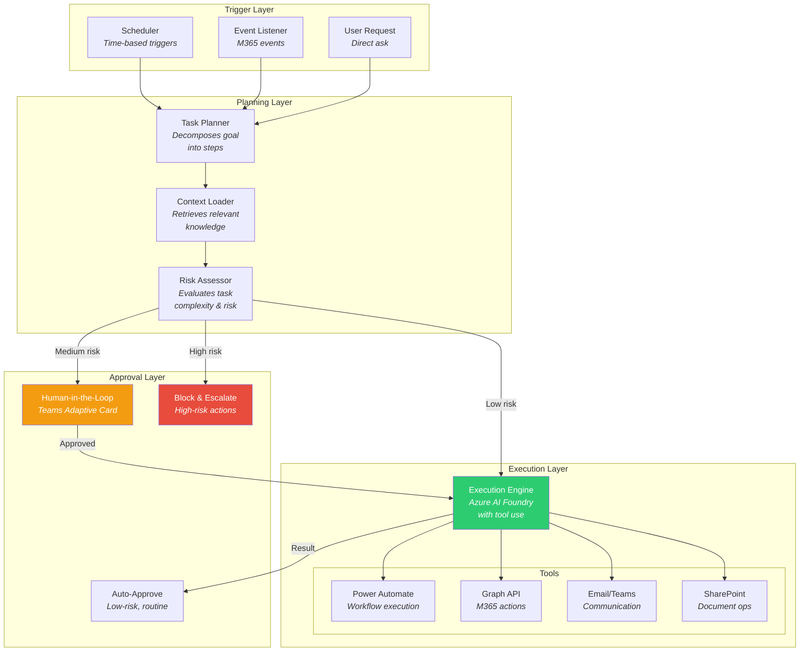
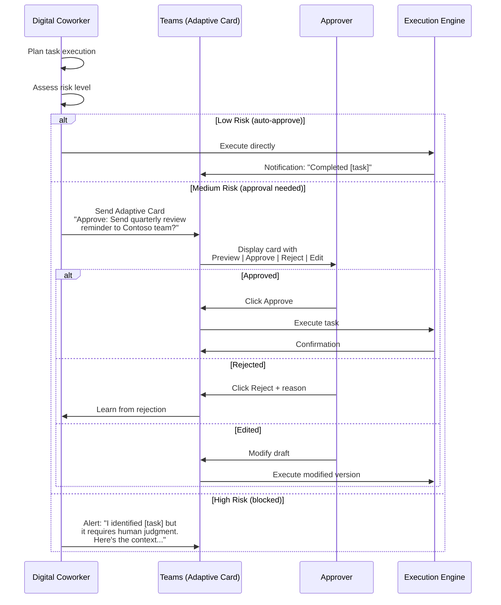

# Digital Coworker — Future Phase

> ⚠️ This document describes the **future vision** for the Knowledge Transfer Agent. Phase 1 focuses on knowledge capture and query. The digital coworker capabilities described here are targeted for Phase 2+.

## Vision

Once institutional knowledge is captured and queryable, the natural evolution is an agent that doesn't just *answer questions* about what the retiree used to do — it can *do the work itself*. The digital coworker is a task-executing agent that inherits the retiree's operational responsibilities.

## Capability Maturity Model

### Level Descriptions

| Level | Name | Autonomy | Human Involvement | Example |
|-------|------|----------|-------------------|---------|
| 1 | **Informer** | None | Full | "The quarterly review process works like this..." |
| 2 | **Advisor** | Suggestion | Decision-making | "It's time for the quarterly Contoso review. Here's what needs to happen..." |
| 3 | **Assistant** | Draft | Approval | "I've drafted the quarterly review agenda and pre-filled the template. Approve to send." |
| 4 | **Executor** | Routine tasks | Exception handling | Automatically generates reports, sends reminders, updates dashboards |
| 5 | **Coworker** | Full (within scope) | Oversight only | Handles vendor communications, escalates edge cases, adapts processes |

## Architecture for Task Execution

## Task Categories

### Routine Tasks (Level 4 — Auto-executable)

Tasks the retiree performed regularly that follow predictable patterns:

| Task | Trigger | Action | Tools Used |
|------|---------|--------|-----------|
| Send quarterly vendor review reminder | Calendar (quarterly) | Draft & send email to stakeholders | Graph API (email) |
| Generate monthly status report | Calendar (monthly) | Pull data, fill template, share | SharePoint, Power Automate |
| Update shared dashboard | Data change event | Refresh charts and metrics | Power BI, SharePoint |
| Respond to FAQ inquiries | Incoming email/message | Recognize FAQ, send standard response | Graph API (email/Teams) |
| Archive completed project files | Project completion trigger | Move files, update metadata | SharePoint, OneDrive |

### Judgment Tasks (Level 5 — Human oversight)

Tasks requiring contextual judgment that the agent learns from the retiree's patterns:

| Task | Complexity | Agent Role | Human Role |
|------|-----------|------------|-----------|
| Vendor escalation | Medium | Draft escalation email, suggest contacts | Review & send |
| Budget reallocation | High | Analyze options, recommend allocation | Decide & approve |
| Process exception handling | Medium | Identify exception, propose resolution | Validate approach |
| New team member onboarding | Low-Medium | Generate personalized onboarding plan | Review & customize |
| Cross-team coordination | High | Draft proposals, schedule meetings | Strategic decisions |

## Human-in-the-Loop Design

### Approval Flow via Teams Adaptive Cards

### Risk Assessment Matrix

| Factor | Low Risk (Auto) | Medium Risk (Approve) | High Risk (Block) |
|--------|----------------|----------------------|-------------------|
| **Financial impact** | < $1,000 | $1,000 - $50,000 | > $50,000 |
| **Audience** | Internal, known recipients | External, known vendors | Unknown or broad external |
| **Reversibility** | Easily undone | Partially reversible | Irreversible |
| **Precedent** | Exact match in history | Similar to past actions | No precedent |
| **Data sensitivity** | Public/Internal | Confidential | Highly Confidential |

## Learning & Improvement

The digital coworker improves over time through:

1. **Approval Feedback** — Approved actions reinforce the model; rejections trigger re-evaluation
2. **Correction Learning** — When a human edits a draft before approving, the agent learns the correction
3. **Outcome Tracking** — Track whether executed actions achieved their intended outcome
4. **Escalation Analysis** — Identify patterns in escalations to reduce future false positives

## Guardrails

### Safety Constraints

- **Scope Lock** — The agent can ONLY perform actions within the retiree's documented domain
- **Blast Radius Limits** — Maximum number of recipients, file modifications, or API calls per action
- **Kill Switch** — Admin can instantly disable all autonomous actions via the web dashboard
- **Audit Everything** — Every planned action, approval decision, and execution result is logged
- **Gradual Rollout** — Start with Level 2 (Advisor) and progressively unlock higher levels per-task based on track record
- **Expiry** — Autonomous capabilities expire after a configurable period (e.g., 12 months) unless explicitly renewed

### Ethical Considerations

- The digital coworker should be **transparently non-human** — it never impersonates the retiree
- Recipients of agent-generated communications should know they're interacting with an AI
- The agent should **defer to humans** on interpersonal or politically sensitive matters
- Regular **bias audits** ensure the agent doesn't perpetuate problematic patterns from the retiree's behavior
