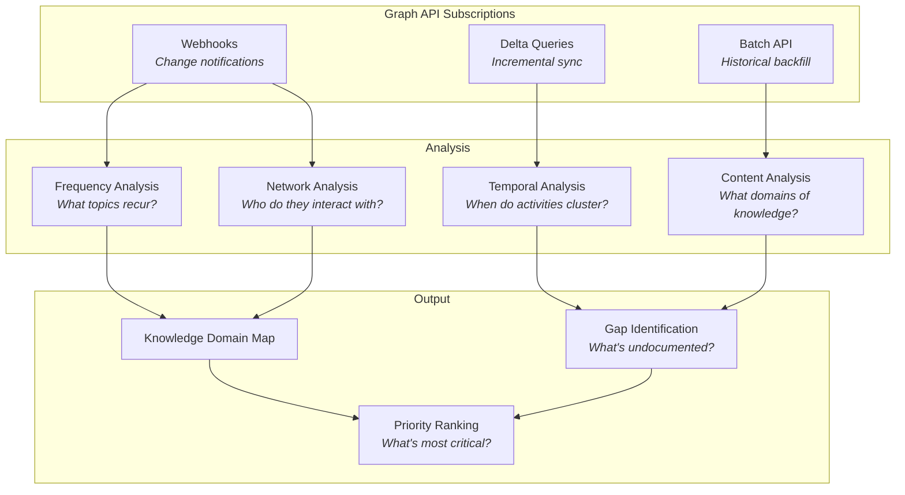
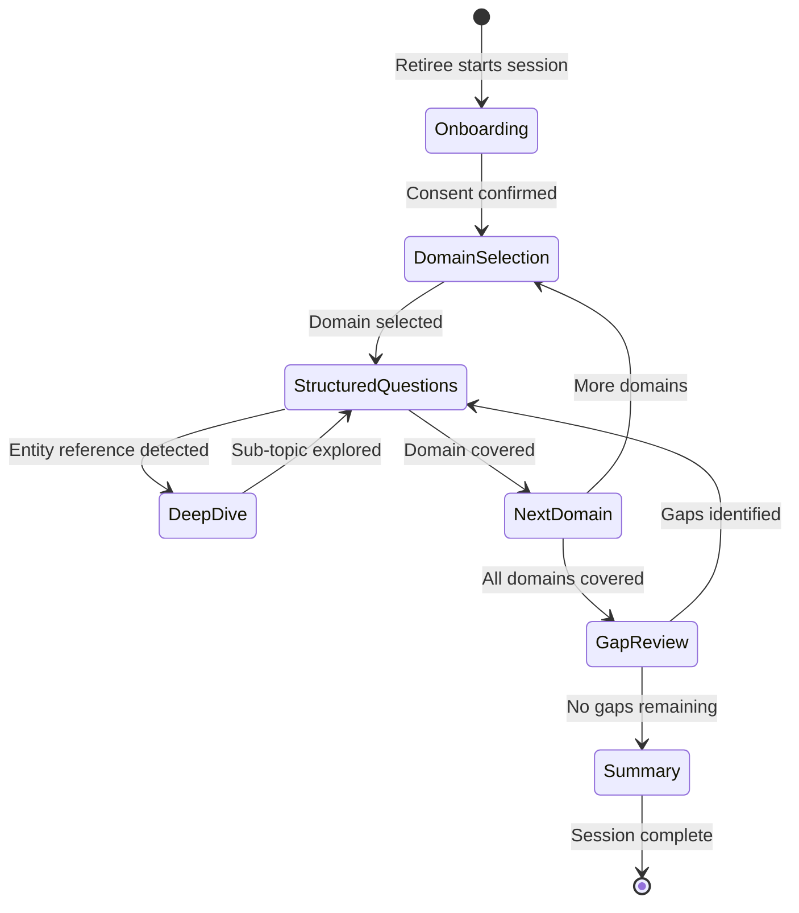
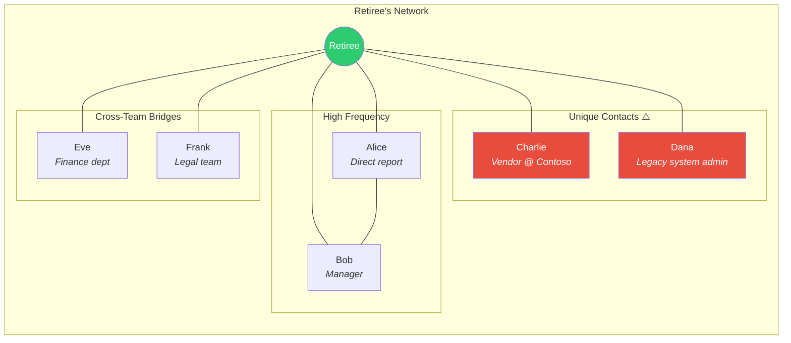

# Extraction Layer

The extraction layer is responsible for capturing knowledge from the retiring employee through two complementary channels: passive observation and structured interviews, plus relationship mapping.

## Components

### 1. Passive Observer

**Technology:** Microsoft Graph API + M365 Copilot APIs

The passive observer monitors the retiree's digital work footprint without requiring active participation. It builds a profile of what the person knows, who they interact with, and what processes they own.

#### Data Sources

| Source | Graph API Endpoint | Knowledge Signal |
|--------|-------------------|-----------------|
| **Emails** | `/users/{id}/messages` | Communication patterns, decision rationale, vendor relationships |
| **Calendar** | `/users/{id}/events` | Recurring meetings, process cadences, stakeholder groups |
| **Teams Messages** | `/users/{id}/chats/messages` | Informal knowledge, quick decisions, troubleshooting context |
| **OneDrive Files** | `/users/{id}/drive/root/children` | Documents authored/modified, knowledge domains |
| **SharePoint** | `/sites/{id}/lists` | Wiki contributions, process documentation ownership |
| **Planner/To Do** | `/users/{id}/planner/tasks` | Ongoing responsibilities, recurring tasks |

#### Observation Strategy

#### Privacy & Consent Model

- Retiree provides **explicit, granular consent** via an onboarding flow
- Consent is stored as a signed JSON document in Azure Blob Storage
- Observation scope can be narrowed (e.g., "work emails only, not personal OneDrive files")
- All observed data is tagged with `observation_consent_id` for auditability
- Retiree can revoke consent at any time, triggering a data retention review

### 2. Interview Agent

**Technology:** Azure AI Foundry (multi-turn conversational agent)

The interview agent conducts structured knowledge capture sessions, adapting its questions based on gaps identified by the passive observer.

#### Interview Flow

#### Question Generation Strategy

The interview agent uses a **three-layer question generation** approach:

1. **Template Layer** — Pre-defined question templates for common knowledge domains:
   - Process ownership: *"Walk me through what happens when [X] occurs"*
   - Decision rationale: *"Why was [system/process] designed this way?"*
   - Escalation paths: *"When [problem] happens, who do you contact and why?"*
   - Vendor relationships: *"Describe your working relationship with [vendor]"*

2. **Observation Layer** — Questions generated from passive observer findings:
   - *"You've had 47 email threads with [person] about [topic]. What's the context?"*
   - *"You attend [meeting] weekly. What decisions get made there?"*
   - *"You're the sole editor of [document]. What would someone need to know to maintain it?"*

3. **Adaptive Layer** — Follow-up questions generated in real-time based on interview responses:
   - Entity extraction triggers: mentions of people, systems, or processes prompt follow-ups
   - Completeness scoring: the agent assesses if an answer fully covers the topic
   - Cross-reference: answers are compared against existing knowledge base for consistency

#### Session Management

- Sessions are **30-45 minutes** to avoid fatigue
- The agent tracks **session history** across multiple meetings
- A **progress dashboard** shows coverage percentage per knowledge domain
- Sessions can be conducted via **Teams chat, Teams call (with transcription), or web UI**

### 3. Relationship Mapper

**Technology:** Microsoft Graph API (People API, Organizational API)

Maps the retiree's professional network to identify:

- **Frequent collaborators** — Who they email/message/meet with most
- **Unique contacts** — People ONLY they interact with (single points of failure)
- **Cross-team bridges** — Where they connect otherwise-isolated groups
- **External contacts** — Vendor and partner relationships

#### Risk Scoring

Each relationship is scored for **knowledge transfer risk**:

| Factor | Weight | Description |
|--------|--------|-------------|
| Exclusivity | 40% | Is the retiree the ONLY person who interacts with this contact? |
| Frequency | 25% | How often do they interact? |
| Topic criticality | 20% | Are the topics discussed business-critical? |
| Documentation level | 15% | Is the relationship/process documented anywhere? |

High-risk relationships are flagged and prioritized for interview sessions.
