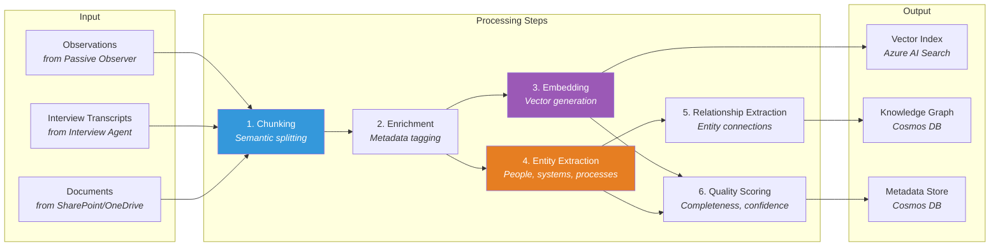
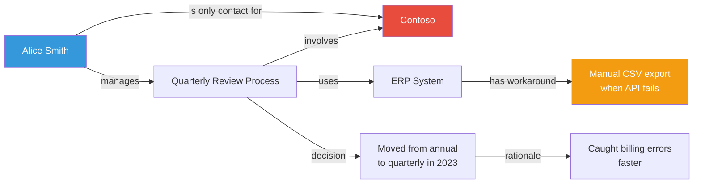

# Processing Layer

The processing layer transforms raw knowledge (observations, interview transcripts, documents) into structured, searchable, and interconnected knowledge artifacts.

## Pipeline Overview



## Step 1: Chunking

**Technology:** Custom chunking logic in Azure Functions

Knowledge content is split into semantically meaningful chunks. Different source types require different chunking strategies:

| Source Type | Chunking Strategy | Target Chunk Size |
|-------------|------------------|-------------------|
| Interview transcripts | Topic-boundary splitting (using GPT-4o to identify topic shifts) | 500-1000 tokens |
| Email threads | Per-message with thread context preserved | 300-500 tokens |
| Documents | Heading-based hierarchical splitting | 500-1000 tokens |
| Meeting transcripts | Speaker-turn + topic-boundary hybrid | 500-800 tokens |
| Teams messages | Conversation-thread grouping | 200-500 tokens |

### Chunk Metadata

Every chunk carries metadata:

```json
{
  "chunk_id": "uuid",
  "source_type": "interview_transcript",
  "source_id": "session-2024-03-15-001",
  "retiree_id": "user-guid",
  "knowledge_domain": "vendor_management",
  "timestamp": "2024-03-15T10:30:00Z",
  "consent_id": "consent-guid",
  "chunk_index": 3,
  "total_chunks": 12,
  "parent_chunk_id": null,
  "entities_mentioned": ["Contoso", "Alice Smith", "ERP System"]
}
```

## Step 2: Enrichment

**Technology:** Azure OpenAI GPT-4o

Each chunk is enriched with AI-generated metadata:

- **Summary** — One-sentence summary of the chunk's content
- **Knowledge type classification** — Tacit / Explicit / Relational
- **Domain tags** — Auto-classified into knowledge domains (e.g., "vendor management", "incident response")
- **Sensitivity level** — Public / Internal / Confidential / Highly Confidential
- **Actionability** — Is this knowledge that could be turned into a procedure or runbook?

## Step 3: Embedding

**Technology:** Azure OpenAI `text-embedding-3-large` (3072 dimensions)

Vectors are generated for:

1. **Full chunk text** — Primary search vector
2. **Summary text** — Secondary search vector for broader matching
3. **Hypothetical question** — "What question would this chunk answer?" (HyDE technique)

All three vectors are stored in Azure AI Search with the full chunk text and metadata.

## Step 4: Entity Extraction

**Technology:** Azure AI Language (NER) + Custom GPT-4o extraction

### Standard NER Categories

| Entity Type | Examples |
|------------|---------|
| Person | "Alice Smith", "the vendor contact at Contoso" |
| Organization | "Contoso", "Finance department", "the DevOps team" |
| System | "ERP System", "the legacy billing platform", "Jenkins" |
| Process | "quarterly vendor review", "incident escalation", "budget approval" |
| Location | "Building 5", "the Seattle datacenter" |
| Document | "the runbook", "SOP-2024-001", "the architecture doc" |

### Custom Entity Types

Beyond standard NER, GPT-4o extracts domain-specific entities:

- **Decision** — A past decision with rationale: *"We chose Cosmos DB because..."*
- **Tribal Knowledge** — Unwritten rules: *"The real reason we do X is..."*
- **Workaround** — Non-standard procedures: *"When the system fails, you have to manually..."*
- **Risk** — Known risks or gotchas: *"Be careful with X because it will break Y"*

## Step 5: Relationship Extraction

**Technology:** GPT-4o with structured output

Relationships between entities are extracted and typed:



### Relationship Types

| Relationship | Description | Example |
|-------------|-------------|---------|
| `owns` | Person owns a process/system | Alice → Quarterly Review |
| `contacts` | Person is primary contact for entity | Alice → Contoso |
| `uses` | Process uses a system | Review → ERP System |
| `has_workaround` | System has an undocumented workaround | ERP → Manual CSV |
| `decided` | A decision was made about an entity | Quarterly cadence → Review |
| `depends_on` | Entity depends on another | Review → ERP System |
| `escalates_to` | Escalation path between people/teams | Tier 1 → Alice → VP Engineering |
| `replaced_by` | Legacy entity being replaced | Old Billing → New ERP |

## Step 6: Quality Scoring

Each knowledge chunk receives a quality score:

| Dimension | Weight | Measurement |
|-----------|--------|-------------|
| **Completeness** | 30% | Does the chunk contain enough context to be useful standalone? |
| **Specificity** | 25% | Does it contain concrete details vs. vague generalities? |
| **Uniqueness** | 20% | Is this knowledge not already documented elsewhere? |
| **Actionability** | 15% | Can someone act on this knowledge? |
| **Recency** | 10% | How recent is the knowledge? |

Chunks scoring below a threshold are flagged for follow-up in the next interview session.

## Pipeline Implementation

The processing pipeline runs as **Azure Functions** triggered by:

1. **Blob trigger** — New interview transcript uploaded
2. **Event Grid** — Graph API change notification (new email, document edit)
3. **Timer trigger** — Periodic re-processing for quality improvements
4. **HTTP trigger** — Manual re-processing of specific content

### Error Handling

- Failed chunks are sent to a **dead-letter queue** (Azure Service Bus)
- Retry with exponential backoff (3 attempts)
- Persistent failures logged to Application Insights with the chunk content for manual review
- Processing is **idempotent** — re-processing a chunk produces the same result
