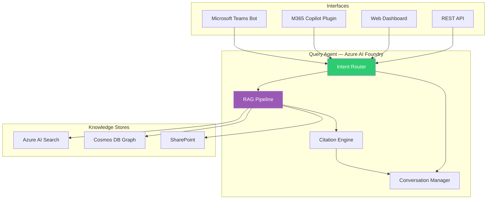
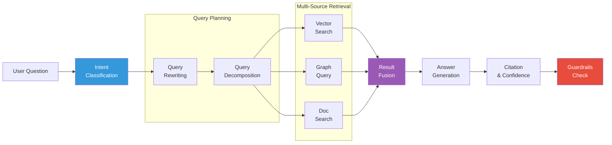
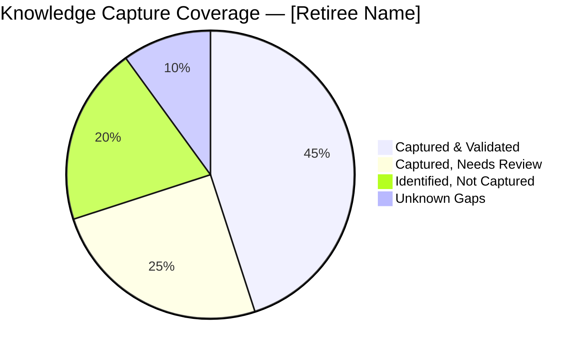

# Serving Layer

The serving layer makes captured knowledge accessible to colleagues through natural language interfaces integrated into their daily workflow.

## Component Overview



## 1. Query Agent

**Technology:** Azure AI Foundry with GPT-4o

The query agent is the core intelligence that answers questions from colleagues using RAG (Retrieval-Augmented Generation) over the knowledge stores.

### Query Processing Pipeline



### Intent Classification

| Intent | Example | Routing |
|--------|---------|---------|
| **Factual** | "What's the Contoso escalation process?" | RAG → Vector + Graph |
| **Relational** | "Who handles vendor relationships for finance?" | Graph-first query |
| **Procedural** | "How do I run the quarterly billing reconciliation?" | RAG → prioritize process docs |
| **Decision context** | "Why did we switch from annual to quarterly reviews?" | RAG → prioritize decision entities |
| **Exploratory** | "What did [retiree] know about the ERP system?" | Broad RAG + domain summary |
| **Meta** | "What knowledge gaps remain for [domain]?" | Quality score analysis |

### Answer Quality Framework

Every answer includes:

1. **Confidence Score** — How confident the agent is (based on retrieval relevance and source count)
2. **Source Citations** — Links to original sources (interview session, email, document)
3. **Knowledge Freshness** — When the knowledge was last validated
4. **Coverage Indicator** — Whether the answer is complete or partial
5. **Suggested Follow-ups** — Related questions the user might want to ask

```json
{
  "answer": "The Contoso escalation process involves three tiers...",
  "confidence": 0.87,
  "sources": [
    { "type": "interview", "session": "2024-03-15", "relevance": 0.94 },
    { "type": "email", "thread_id": "AAMk...", "relevance": 0.82 },
    { "type": "document", "url": "https://sharepoint.com/...", "relevance": 0.78 }
  ],
  "freshness": "2024-03-15T10:30:00Z",
  "coverage": "complete",
  "follow_ups": [
    "Who are the key contacts at Contoso?",
    "What are the SLA terms for escalations?"
  ]
}
```

## 2. Microsoft Teams Bot

**Technology:** Microsoft Bot Framework SDK + Teams AI Library

The primary user interface. Colleagues interact with the knowledge agent directly in Teams where they already work.

### Features

| Feature | Description |
|---------|-------------|
| **Natural language Q&A** | Ask questions in plain English, get sourced answers |
| **Adaptive Cards** | Rich response formatting with expandable source details |
| **Conversation threading** | Multi-turn conversations with context retention |
| **Proactive notifications** | Alert teams about captured knowledge relevant to their work |
| **Feedback loop** | 👍/👎 on answers to improve retrieval quality |
| **Handoff to human** | If confidence is low, route to a human expert |

### Interaction Example

```
👤 User: Who handles the quarterly vendor review for Contoso?

🤖 KT Agent: Based on knowledge from [Retiree Name]'s transfer sessions:

The quarterly vendor review for Contoso was managed by [Retiree]. 
Key details:

• **Process owner**: [Retiree] (sole owner — flagged as knowledge gap ⚠️)
• **Successor suggestion**: Alice Smith (frequently collaborated on vendor topics)
• **Cadence**: First Monday of each quarter
• **Key contacts**: Charlie Brown (Contoso Account Manager, charlie@contoso.com)
• **Critical document**: [Vendor Review Template](sharepoint-link)

📎 Sources: Interview session Mar 15, Email thread #4521, SharePoint doc
🟢 Confidence: 87% | Last validated: Mar 15, 2024

💡 Related: "What are the SLA terms with Contoso?" | "What does the review template contain?"

👍 👎 Was this helpful?
```

## 3. M365 Copilot Plugin

**Technology:** M365 Copilot Extensibility (Declarative Agents + API Plugins)

Integrates knowledge transfer insights directly into Microsoft 365 Copilot, surfacing relevant knowledge contextually.

### Copilot Integration Points

| Scenario | Trigger | Knowledge Surfaced |
|----------|---------|-------------------|
| **Email context** | User drafts email to a contact the retiree managed | Relationship context, communication preferences |
| **Meeting prep** | User joins a meeting the retiree used to attend | Meeting purpose, typical agenda, key decisions |
| **Document editing** | User opens a document the retiree authored | Document context, related processes, gotchas |
| **Search** | User searches for a topic in the retiree's domain | Relevant knowledge chunks, process docs |

### Declarative Agent Configuration

```json
{
  "name": "Knowledge Transfer Assistant",
  "description": "Access institutional knowledge from retiring employees",
  "instructions": "You help colleagues find institutional knowledge captured from retiring employees. Always cite your sources and indicate confidence levels. If knowledge is incomplete, say so and suggest who might know more.",
  "capabilities": [
    {
      "name": "search_knowledge",
      "description": "Search the knowledge transfer database",
      "api_plugin": "kt-agent-api"
    },
    {
      "name": "get_relationship_context",
      "description": "Get relationship and contact context from the knowledge graph",
      "api_plugin": "kt-agent-api"
    }
  ],
  "conversation_starters": [
    "What did [name] know about [topic]?",
    "Who handles [process] now that [name] has retired?",
    "What's the escalation process for [vendor/system]?"
  ]
}
```

## 4. Web Dashboard

**Technology:** React + Azure Static Web Apps (or Power Apps for low-code)

An admin and analytics interface for managing the knowledge transfer program.

### Dashboard Views

| View | Audience | Purpose |
|------|----------|---------|
| **Transfer Progress** | HR / Manager | Track knowledge capture coverage per retiree |
| **Knowledge Map** | Team leads | Visualize knowledge domains and coverage |
| **Gap Analysis** | All | Identify undocumented critical knowledge |
| **Query Analytics** | Admin | What questions are asked, answer quality trends |
| **Risk Dashboard** | Management | Single points of failure, unmitigated knowledge risks |

### Knowledge Coverage Visualization



## Guardrails & Safety

The serving layer implements several safety measures:

1. **PII Redaction** — Sensitive personal information is redacted unless the user has explicit access
2. **Scope Enforcement** — Users only see knowledge from retirees whose team/domain they have access to
3. **Hallucination Detection** — Answers are validated against retrieved sources; unsupported claims are flagged
4. **Content Safety** — Azure AI Content Safety filters for inappropriate content
5. **Rate Limiting** — Prevents excessive querying that could indicate data exfiltration
6. **Audit Trail** — Every query and response is logged for compliance review
