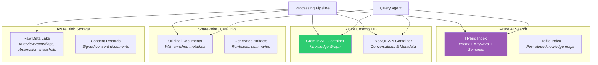
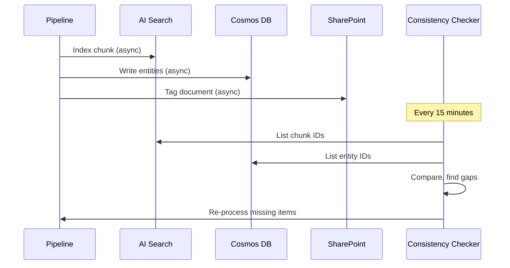

# Storage Layer

The storage layer provides durable, queryable storage for all knowledge artifacts. It uses three complementary stores optimized for different query patterns.

## Storage Architecture



## 1. Azure AI Search — Vector Store

The primary retrieval store. Uses Azure AI Search's **hybrid search** capabilities combining vector similarity, keyword matching, and semantic ranking.

### Index Schema

```json
{
  "name": "knowledge-chunks",
  "fields": [
    { "name": "id", "type": "Edm.String", "key": true },
    { "name": "content", "type": "Edm.String", "searchable": true, "analyzer": "en.microsoft" },
    { "name": "summary", "type": "Edm.String", "searchable": true },
    { "name": "content_vector", "type": "Collection(Edm.Single)", "dimensions": 3072, "vectorSearchProfile": "hnsw-profile" },
    { "name": "summary_vector", "type": "Collection(Edm.Single)", "dimensions": 3072, "vectorSearchProfile": "hnsw-profile" },
    { "name": "hyde_vector", "type": "Collection(Edm.Single)", "dimensions": 3072, "vectorSearchProfile": "hnsw-profile" },
    { "name": "source_type", "type": "Edm.String", "filterable": true, "facetable": true },
    { "name": "retiree_id", "type": "Edm.String", "filterable": true },
    { "name": "knowledge_domain", "type": "Edm.String", "filterable": true, "facetable": true },
    { "name": "knowledge_type", "type": "Edm.String", "filterable": true },
    { "name": "sensitivity_level", "type": "Edm.String", "filterable": true },
    { "name": "quality_score", "type": "Edm.Double", "filterable": true, "sortable": true },
    { "name": "entities", "type": "Collection(Edm.String)", "filterable": true },
    { "name": "timestamp", "type": "Edm.DateTimeOffset", "filterable": true, "sortable": true },
    { "name": "consent_id", "type": "Edm.String", "filterable": true }
  ],
  "vectorSearch": {
    "algorithms": [{ "name": "hnsw", "kind": "hnsw", "hnswParameters": { "m": 4, "efConstruction": 400, "efSearch": 500 } }],
    "profiles": [{ "name": "hnsw-profile", "algorithm": "hnsw" }]
  },
  "semantic": {
    "configurations": [{
      "name": "default",
      "prioritizedFields": {
        "titleField": { "fieldName": "summary" },
        "contentFields": [{ "fieldName": "content" }]
      }
    }]
  }
}
```

### Search Strategy

The query agent uses a **multi-vector retrieval** approach:

1. **Content vector search** — Semantic similarity against chunk content
2. **HyDE vector search** — Match question against hypothetical questions
3. **Keyword search** — BM25 over content and summary fields
4. **Semantic reranking** — Azure AI Search semantic ranker for final ordering

Results are fused using **Reciprocal Rank Fusion (RRF)** with learned weights.

## 2. Azure Cosmos DB — Knowledge Graph

Uses the **Gremlin API** to store and query the knowledge graph of entities and their relationships.

### Vertex Types

| Vertex Label | Properties | Description |
|-------------|------------|-------------|
| `Person` | name, role, org, email, is_retiree, risk_score | People in the retiree's network |
| `Process` | name, description, frequency, criticality | Business processes |
| `System` | name, type, status, documentation_url | Software systems and tools |
| `Decision` | summary, rationale, date, impact | Past decisions with context |
| `Document` | title, url, type, last_modified | Documents and artifacts |
| `KnowledgeDomain` | name, coverage_pct, priority | High-level knowledge areas |
| `Workaround` | description, trigger, system, risk | Undocumented workarounds |
| `Vendor` | name, contract_status, primary_contact | External vendor relationships |

### Edge Types

| Edge Label | From → To | Properties |
|-----------|-----------|------------|
| `owns` | Person → Process/System | since, exclusivity |
| `contacts` | Person → Person/Vendor | frequency, channel |
| `uses` | Process → System | criticality |
| `decided` | Person → Decision | date |
| `documents` | Document → Process/System | coverage |
| `depends_on` | Process → System/Process | criticality |
| `escalates_to` | Person → Person | context |
| `has_workaround` | System → Workaround | discovered_date |
| `belongs_to` | Entity → KnowledgeDomain | relevance |

### Example Graph Query

```gremlin
// Find all processes owned exclusively by the retiree
// that have no documentation
g.V().hasLabel('Person').has('is_retiree', true)
  .outE('owns').has('exclusivity', 'sole')
  .inV().hasLabel('Process')
  .where(__.not(__.inE('documents')))
  .project('process', 'criticality')
  .by('name')
  .by('criticality')
```

## 3. SharePoint / OneDrive — Document Store

Original documents and generated artifacts are stored in SharePoint with enriched metadata columns.

### Metadata Enrichment

Documents the retiree authored or frequently edited are tagged with:

| Column | Type | Description |
|--------|------|-------------|
| `kt_retiree` | Person | Retiring employee who owns this knowledge |
| `kt_domain` | Choice | Knowledge domain classification |
| `kt_criticality` | Choice | Low / Medium / High / Critical |
| `kt_successor` | Person | Who should own this knowledge post-retirement |
| `kt_status` | Choice | Not reviewed / In transfer / Transferred / Archived |
| `kt_last_validated` | DateTime | When the content was last confirmed accurate |

### Generated Artifacts

The system can generate new documents based on captured knowledge:

- **Process Runbooks** — Step-by-step procedures extracted from interviews
- **Contact Handover Sheets** — Relationship maps with context for each contact
- **Decision Logs** — Structured records of past decisions with rationale
- **FAQ Documents** — Common questions and answers derived from the knowledge base

## 4. Azure Blob Storage — Raw Data Lake

Stores raw, unprocessed data for compliance and reprocessing:

```
kt-agent-data/
├── observations/
│   ├── {retiree_id}/
│   │   ├── emails/{date}/
│   │   ├── meetings/{date}/
│   │   └── documents/{date}/
├── interviews/
│   ├── {retiree_id}/
│   │   ├── {session_id}/
│   │   │   ├── transcript.json
│   │   │   ├── audio.mp3 (if recorded)
│   │   │   └── annotations.json
├── consent/
│   ├── {retiree_id}/
│   │   ├── consent-v1-signed.json
│   │   └── consent-v2-signed.json
└── processed/
    ├── chunks/
    ├── embeddings/
    └── entities/
```

### Lifecycle Management

| Tier | Age | Content |
|------|-----|---------|
| Hot | 0-90 days | Active knowledge capture data |
| Cool | 90-365 days | Recently completed transfers |
| Archive | 1-7 years | Compliance retention |
| Delete | 7+ years | Per data retention policy |

## Data Consistency

The storage layer uses an **eventual consistency** model:

1. **Write path:** Processing pipeline writes to all stores in parallel
2. **Consistency check:** A periodic Azure Function verifies cross-store consistency
3. **Reconciliation:** Missing entries are re-processed from the raw data lake
4. **Conflict resolution:** Latest-write-wins with version tracking in Cosmos DB


