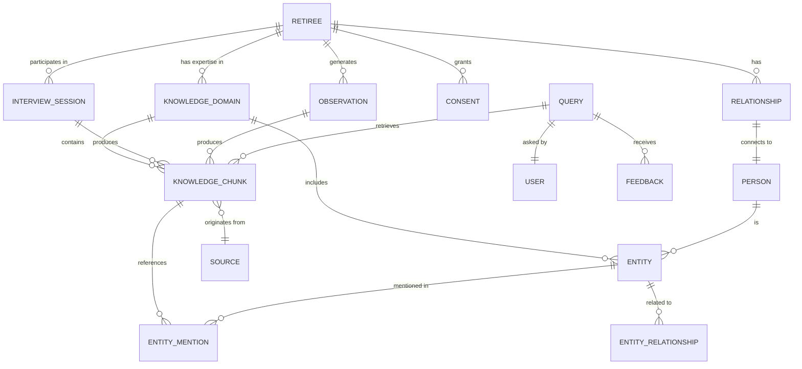
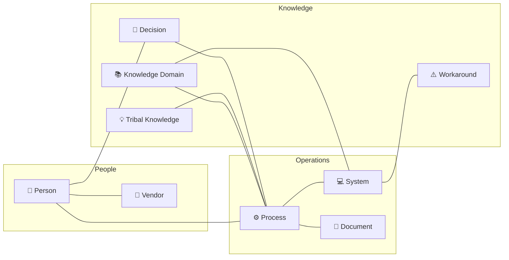
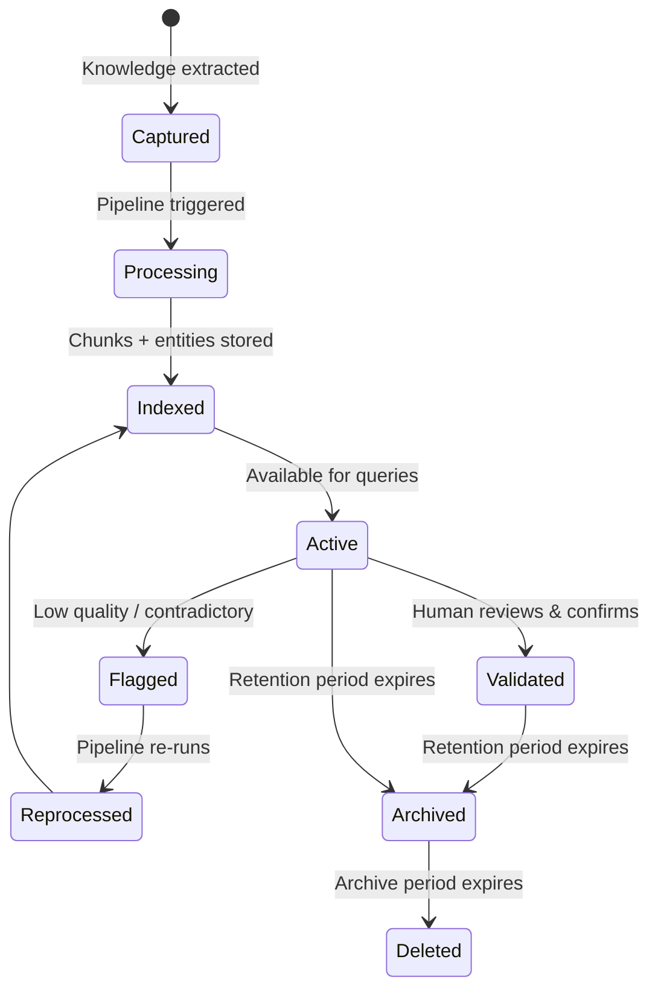

# Data Model

This document describes the entity relationships and schema design for the Knowledge Transfer Agent's storage layer.

## Entity Relationship Overview



## Core Entities

### Retiree Profile

The central entity representing a retiring employee undergoing knowledge transfer.

```json
{
  "id": "retiree-guid",
  "entra_id": "user-object-id",
  "name": "Jane Doe",
  "email": "jane.doe@company.com",
  "department": "Engineering",
  "team": "Platform Team",
  "role": "Senior Systems Engineer",
  "retirement_date": "2024-06-30",
  "kt_start_date": "2024-03-01",
  "status": "active",
  "knowledge_domains": ["vendor_management", "legacy_systems", "incident_response"],
  "overall_coverage": 0.65,
  "consent_id": "consent-guid",
  "manager_id": "user-guid",
  "successor_ids": ["user-guid-1", "user-guid-2"]
}
```

### Knowledge Domain

A high-level area of expertise. Used to organize and track knowledge capture coverage.

```json
{
  "id": "domain-guid",
  "retiree_id": "retiree-guid",
  "name": "Vendor Management — Contoso",
  "description": "All knowledge related to managing the Contoso vendor relationship",
  "parent_domain": "vendor_management",
  "criticality": "high",
  "coverage": {
    "captured": 0.70,
    "validated": 0.55,
    "gaps_identified": 3
  },
  "sources": {
    "interviews": 5,
    "observations": 127,
    "documents": 12
  },
  "suggested_successor": "user-guid-1",
  "tags": ["vendor", "contoso", "finance", "quarterly-review"]
}
```

### Knowledge Chunk

The atomic unit of knowledge. Every piece of captured knowledge is stored as a chunk with full provenance.

```json
{
  "id": "chunk-guid",
  "content": "The quarterly vendor review for Contoso involves pulling usage data from the ERP system, comparing against contracted SLAs, and preparing a summary deck. Alice from Finance always needs the cost breakdown by department. The key gotcha is that ERP exports before 8am UTC return stale data from the previous day.",
  "summary": "Quarterly Contoso vendor review process with ERP data export timing gotcha",
  "knowledge_type": "tacit",
  "domain_id": "domain-guid",
  "retiree_id": "retiree-guid",
  "source": {
    "type": "interview",
    "session_id": "session-guid",
    "timestamp": "2024-03-15T10:30:00Z"
  },
  "entities_mentioned": [
    { "entity_id": "entity-1", "text": "Contoso", "type": "Vendor" },
    { "entity_id": "entity-2", "text": "ERP system", "type": "System" },
    { "entity_id": "entity-3", "text": "Alice", "type": "Person" }
  ],
  "quality_score": {
    "overall": 0.85,
    "completeness": 0.90,
    "specificity": 0.95,
    "uniqueness": 0.80,
    "actionability": 0.75,
    "recency": 0.80
  },
  "sensitivity_level": "internal",
  "consent_id": "consent-guid",
  "embeddings": {
    "content_vector_id": "vec-1",
    "summary_vector_id": "vec-2",
    "hyde_vector_id": "vec-3"
  }
}
```

### Entity

A named entity extracted from knowledge chunks. Entities form the nodes of the knowledge graph.

```json
{
  "id": "entity-guid",
  "type": "System",
  "name": "ERP System",
  "aliases": ["the ERP", "SAP", "the billing system"],
  "description": "Core enterprise resource planning system used for financial operations",
  "properties": {
    "status": "active",
    "documentation_url": "https://sharepoint.com/sites/docs/erp",
    "owner": "user-guid",
    "criticality": "critical"
  },
  "mention_count": 47,
  "domains": ["vendor_management", "financial_operations", "reporting"],
  "first_seen": "2024-03-01T09:00:00Z",
  "last_seen": "2024-03-20T14:00:00Z"
}
```

### Entity Relationship

Relationships between entities in the knowledge graph.

```json
{
  "id": "rel-guid",
  "source_entity_id": "entity-1",
  "target_entity_id": "entity-2",
  "relationship_type": "uses",
  "properties": {
    "criticality": "high",
    "frequency": "quarterly",
    "documented": false
  },
  "evidence": [
    { "chunk_id": "chunk-1", "confidence": 0.92 },
    { "chunk_id": "chunk-7", "confidence": 0.87 }
  ],
  "first_observed": "2024-03-01",
  "last_observed": "2024-03-20"
}
```

## Knowledge Graph Schema

### Vertex (Node) Types



### Edge (Relationship) Types

| Edge | From | To | Description | Key Properties |
|------|------|-----|-------------|---------------|
| `owns` | Person | Process, System | Primary ownership | exclusivity, since |
| `contacts` | Person | Person, Vendor | Communication relationship | frequency, channel, topics |
| `uses` | Process | System | Process depends on system | criticality |
| `documents` | Document | Process, System | Documentation coverage | completeness, freshness |
| `decided` | Person | Decision | Person made a decision | date, context |
| `has_workaround` | System | Workaround | Known undocumented fix | risk_level, discovered |
| `depends_on` | Process, System | Process, System | Dependency relationship | criticality |
| `escalates_to` | Person | Person | Escalation path | context, frequency |
| `belongs_to` | Any | KnowledgeDomain | Domain classification | relevance_score |
| `succeeded_by` | Person | Person | Knowledge successor | domains, readiness |
| `rationale_for` | Decision | Process, System | Why something is done this way | |

## Cosmos DB Collections

### NoSQL API (Core storage)

| Collection | Partition Key | Description |
|-----------|--------------|-------------|
| `retirees` | `/id` | Retiree profiles and KT status |
| `knowledge-chunks` | `/retiree_id` | All knowledge chunks (co-located per retiree) |
| `interview-sessions` | `/retiree_id` | Interview transcripts and metadata |
| `observations` | `/retiree_id` | Passive observation records |
| `queries` | `/user_id` | Query history and feedback |
| `consent` | `/retiree_id` | Consent documents (immutable) |

### Gremlin API (Knowledge graph)

| Container | Description |
|-----------|-------------|
| `knowledge-graph` | All vertices and edges for entity relationships |

### Throughput Planning

| Collection | Expected Volume | RU/s (estimated) |
|-----------|----------------|-------------------|
| `knowledge-chunks` | ~10K per retiree | 400 (serverless) |
| `interview-sessions` | ~50 per retiree | 400 (serverless) |
| `observations` | ~50K per retiree | 1000 (serverless) |
| `queries` | ~1K/day org-wide | 400 (serverless) |
| `knowledge-graph` | ~5K vertices per retiree | 1000 (serverless) |

> Using **serverless** mode for all collections — cost-effective for this workload pattern with bursty reads during work hours and minimal overnight activity.

## Azure AI Search Index Design

### Primary Index: `knowledge-chunks`

See [Storage Layer — Index Schema](components/storage-layer.md) for the full field definition.

### Secondary Index: `retiree-profiles`

A lightweight index for searching across retirees and their knowledge domains:

| Field | Type | Purpose |
|-------|------|---------|
| `retiree_id` | String (key) | Unique identifier |
| `name` | String (searchable) | Retiree's name |
| `department` | String (filterable) | Department |
| `domains` | Collection(String) (filterable) | Knowledge domains |
| `coverage` | Double (sortable) | Overall capture coverage |
| `retirement_date` | DateTime (filterable) | When they're leaving |

## Data Lifecycle


