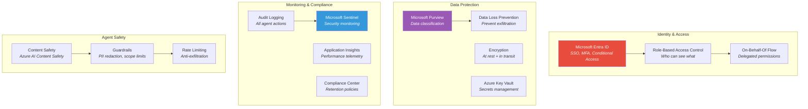
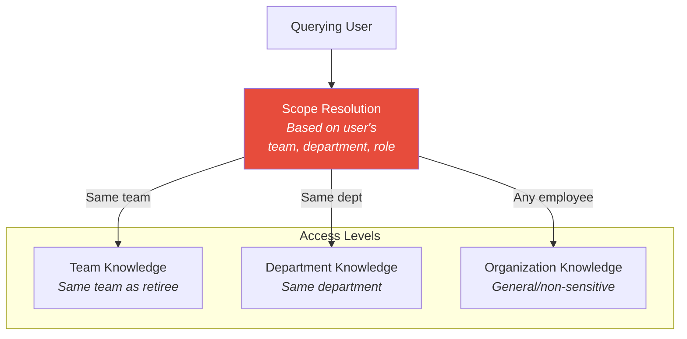
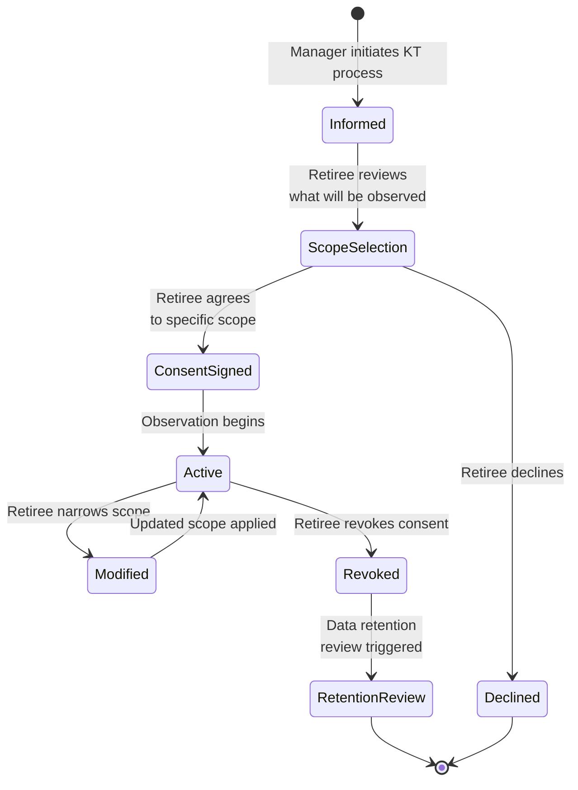

# Security & Governance

This document describes the security architecture, access controls, compliance measures, and consent framework for the Knowledge Transfer Agent.

## Security Architecture Overview



## Authentication & Authorization

### Identity Provider

**Microsoft Entra ID** serves as the single identity provider for all components.

| Component | Auth Method | Token Type |
|-----------|------------|-----------|
| Teams Bot | SSO via Teams | User token (delegated) |
| Copilot Plugin | M365 Copilot SSO | User token (delegated) |
| Web Dashboard | MSAL.js PKCE flow | User token (delegated) |
| Processing Pipeline | Managed Identity | App token (application) |
| Agent Orchestrator | Managed Identity + OBO | App + delegated |

### Role-Based Access Control

| Role | Description | Permissions |
|------|-------------|-------------|
| **KT Admin** | IT administrators managing the system | Full access: configure agents, manage policies, view all data |
| **KT Manager** | Managers overseeing knowledge transfer | View transfer progress, approve scope changes, access analytics |
| **KT Retiree** | The retiring employee | Manage consent, participate in interviews, review captured knowledge |
| **KT Consumer** | Colleagues querying the knowledge base | Query knowledge within their authorized scope |
| **KT Auditor** | Compliance/audit personnel | Read-only access to audit logs and compliance reports |

### Scope-Based Data Access

Knowledge access is scoped by organizational context:



**Rules:**
- Same-team members can access all non-confidential knowledge from their team's retiree
- Same-department members can access department-level knowledge
- Any employee can access organization-level, non-sensitive knowledge
- Confidential/HC knowledge requires explicit access grants

## Consent Framework

### Retiree Consent Model

The retiree must provide explicit, informed, granular consent before any observation begins.

#### Consent Flow



#### Consent Document Structure

```json
{
  "consent_id": "uuid",
  "retiree_id": "user-guid",
  "version": 2,
  "granted_at": "2024-03-01T09:00:00Z",
  "expires_at": "2024-09-01T00:00:00Z",
  "scope": {
    "email": { "enabled": true, "filter": "work_only" },
    "calendar": { "enabled": true, "filter": "all" },
    "teams_messages": { "enabled": true, "filter": "work_channels_only" },
    "onedrive": { "enabled": true, "filter": "work_folders_only" },
    "sharepoint": { "enabled": true, "filter": "all" },
    "interviews": { "enabled": true, "recording": "transcript_only" }
  },
  "exclusions": [
    "personal_folder/*",
    "messages_with:spouse@personal.com"
  ],
  "signatures": {
    "retiree": "digital-signature",
    "manager": "digital-signature",
    "hr": "digital-signature"
  }
}
```

### Data Subject Rights

The retiree retains rights over their captured knowledge:

| Right | Implementation |
|-------|---------------|
| **Right to review** | Dashboard showing all captured knowledge |
| **Right to correct** | Edit or annotate captured knowledge |
| **Right to delete** | Request deletion of specific items |
| **Right to restrict** | Narrow observation scope at any time |
| **Right to withdraw** | Full consent revocation with data retention review |

## Data Classification

### Microsoft Purview Integration

All knowledge artifacts are automatically classified:

| Sensitivity Level | Label | Access Policy | Examples |
|------------------|-------|--------------|---------|
| **Public** | 🟢 Public | Any employee | General process descriptions |
| **Internal** | 🟡 Internal | Authenticated employees | Internal contacts, system names |
| **Confidential** | 🟠 Confidential | Role-based access | Vendor contract details, financial data |
| **Highly Confidential** | 🔴 HC | Explicit grant only | Security credentials, legal matters |

### Automatic Classification Rules

- Content mentioning financial figures > $10K → Confidential
- Content mentioning legal proceedings → Highly Confidential
- Content mentioning personal employee information → Confidential
- Vendor contract terms → Confidential
- System passwords/credentials → **Blocked from capture**

## Audit Logging

### What Gets Logged

| Event Category | Events | Storage |
|---------------|--------|---------|
| **Consent** | Granted, modified, revoked | Immutable blob + Log Analytics |
| **Observation** | Data accessed, patterns detected | Log Analytics |
| **Interview** | Session start/end, topics covered | Log Analytics + Cosmos DB |
| **Processing** | Chunks created, entities extracted | Application Insights |
| **Query** | Questions asked, answers returned, confidence | Log Analytics |
| **Task Execution** | Actions planned, approved/rejected, executed | Log Analytics + immutable blob |
| **Admin** | Policy changes, role assignments, config changes | Entra ID audit logs |

### Audit Log Schema

```json
{
  "timestamp": "2024-03-15T10:30:00Z",
  "event_type": "knowledge_query",
  "actor": {
    "user_id": "user-guid",
    "role": "kt_consumer",
    "ip_address": "10.0.0.1"
  },
  "action": {
    "type": "query",
    "query_text": "Who handles Contoso escalations?",
    "knowledge_scope": ["retiree-guid-1"],
    "results_count": 3,
    "confidence": 0.87
  },
  "resource": {
    "type": "knowledge_chunk",
    "ids": ["chunk-1", "chunk-2", "chunk-3"],
    "sensitivity_levels": ["internal", "internal", "confidential"]
  },
  "authorization": {
    "decision": "allow",
    "policy": "same-department-access",
    "scope_applied": "department"
  }
}
```

## Network Security

- All Azure services communicate over **private endpoints** (no public internet)
- **Azure Virtual Network** isolates the agent's compute and storage
- **Azure Front Door** with WAF for any public-facing endpoints (web dashboard)
- **TLS 1.3** for all data in transit
- **Azure Disk Encryption** + **Cosmos DB encryption** for data at rest

## Compliance Considerations

| Regulation | Relevance | Measures |
|-----------|-----------|----------|
| **GDPR** | Employee data processing | Consent framework, data subject rights, retention policies |
| **SOC 2** | Security controls | Audit logging, access controls, encryption |
| **ISO 27001** | Information security | Comprehensive security architecture |
| **Local labor laws** | Employee monitoring | Explicit consent, proportionality, union consultation where required |
| **AI regulations** | Automated decision-making | Transparency, human oversight, bias monitoring |

> ⚠️ **Important:** Organizations must consult with legal counsel to ensure the knowledge transfer agent complies with local labor laws regarding employee monitoring. Some jurisdictions require works council approval or union consultation.
