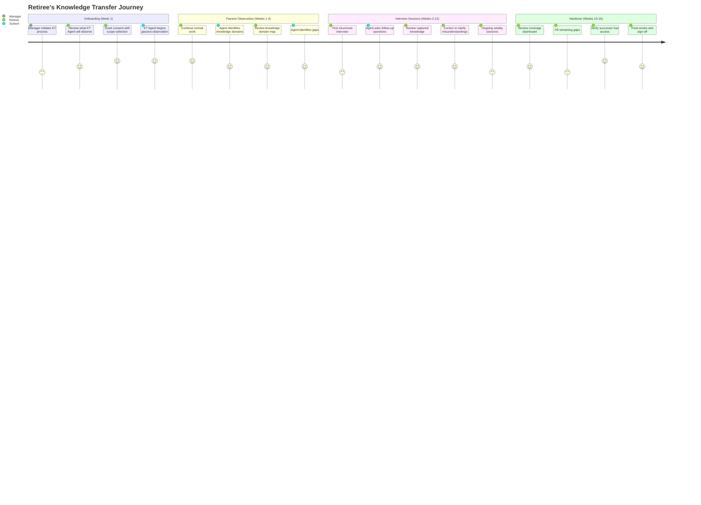
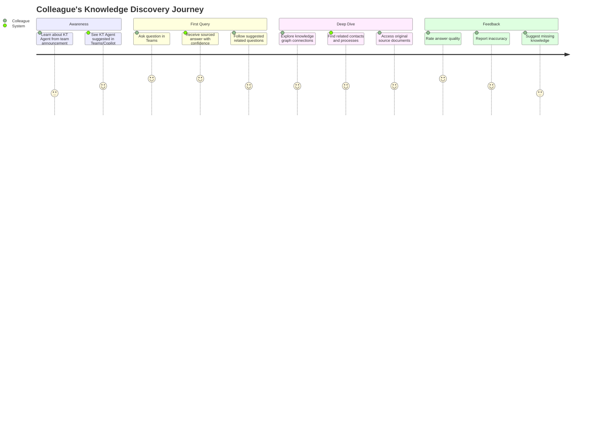
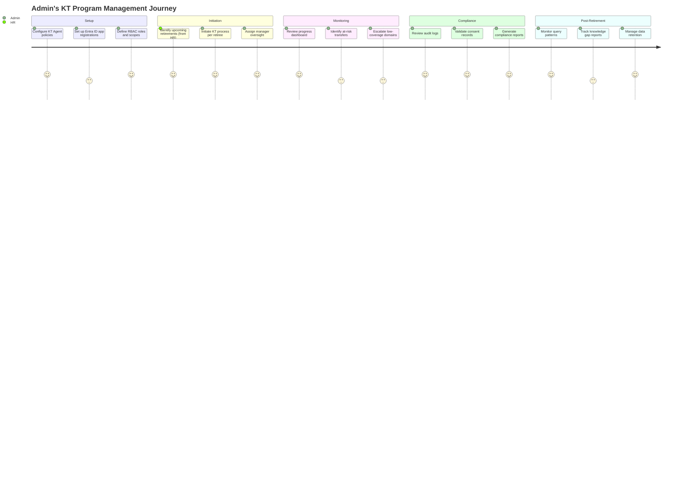
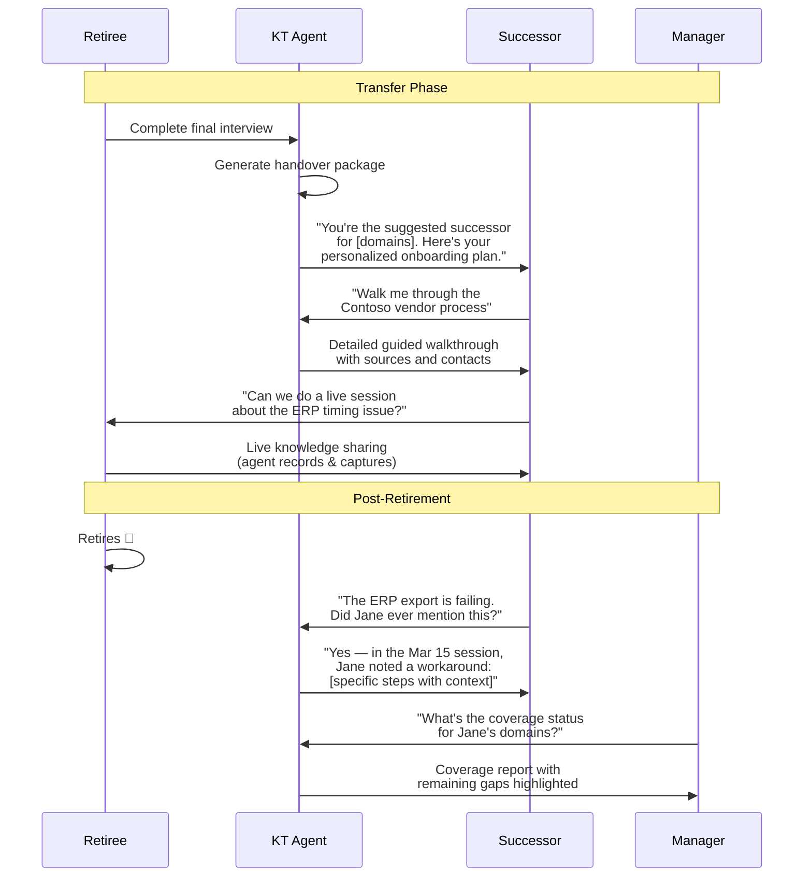

# User Journeys

This document describes the key user journeys for the three primary personas interacting with the Knowledge Transfer Agent.

## Personas

| Persona | Role | Goal |
|---------|------|------|
| **The Retiree** | Retiring employee with critical knowledge | Transfer knowledge effectively before departure |
| **The Colleague** | Team member who needs the retiree's knowledge | Find answers and continue work after retiree leaves |
| **The Admin** | IT/HR administrator | Manage the KT program, ensure compliance |

---

## Journey 1: The Retiree

### Overview

The retiree's journey spans from the moment knowledge transfer is initiated (typically 3-6 months before retirement) through their final day.



### Detailed Steps

#### 1. Onboarding

1. **Manager initiates** — Manager triggers the KT process in the admin dashboard, selecting the retiring employee
2. **Information session** — The retiree receives an overview (via email + optional Teams call with the agent) explaining:
   - What the agent will observe (with specific examples)
   - What interview sessions look like
   - How captured knowledge will be stored and used
   - Their rights (review, correct, restrict, withdraw)
3. **Consent flow** — The retiree uses a guided UI to:
   - Select which data sources to include (email, calendar, Teams, OneDrive, SharePoint)
   - Set exclusions (personal folders, specific contacts)
   - Choose interview preferences (frequency, duration, channel)
   - Digitally sign the consent document
4. **Observation begins** — The passive observer starts monitoring (within consented scope)

#### 2. Interview Sessions

Interview sessions are the retiree's primary active contribution. The agent conducts 30-45 minute sessions, typically weekly.

**Session structure:**
- **Opening (5 min)** — Agent reviews what was captured since last session, confirms accuracy
- **Guided questions (25 min)** — Agent asks questions prioritized by knowledge gap severity
- **Reflection (5 min)** — Agent summarizes what was captured, retiree corrects if needed
- **Preview (5 min)** — Agent previews next session's focus area

**Example interaction:**

> 🤖 **Agent:** Last time we talked about the Contoso quarterly review. Since then, I noticed you exchanged 12 emails with Charlie Brown at Contoso about the Q2 SLA metrics. Can you tell me about the SLA review process?
>
> 👤 **Retiree:** Sure. After pulling the usage data from the ERP — and by the way, never pull before 8am UTC or you get yesterday's data — I compare against the contracted SLAs in the master agreement. Charlie usually flags any overages in advance...
>
> 🤖 **Agent:** That's a great detail about the 8am UTC timing. I've flagged that as a "gotcha" for the ERP system. You mentioned a "master agreement" — is that the document in the Legal SharePoint site?
>
> 👤 **Retiree:** No, actually there's a more recent version that Charlie sent me last quarter. Let me share it...

#### 3. Knowledge Review

The retiree has access to a dashboard showing:
- **Coverage by domain** — Percentage of each knowledge area captured
- **Captured items** — Browsable list of all knowledge chunks with source attribution
- **Flagged items** — Items the agent is uncertain about, needing confirmation
- **Edit capability** — Correct, annotate, or request deletion of any item

---

## Journey 2: The Colleague

### Overview

The colleague's journey begins when they need knowledge the retiree held — either during the transition period or after retirement.



### Interaction Patterns

#### Pattern 1: Direct Question (Teams Bot)

The most common pattern — a colleague needs a specific answer.

```
👤 Colleague: @KTAgent How do I prepare the quarterly vendor report for Contoso?

🤖 KT Agent: Based on [Jane Doe]'s knowledge transfer:

**Quarterly Vendor Report — Contoso**

1. **Pull usage data** from the ERP system
   ⚠️ Important: Only pull data after 8:00 AM UTC to avoid stale data
   
2. **Compare against SLAs** using the master agreement
   📎 [Master Agreement v3.2](sharepoint-link) (updated Q1 2024)
   
3. **Prepare summary deck** using the [Quarterly Review Template](sharepoint-link)
   - Include department cost breakdown (Alice from Finance needs this)
   - Flag any SLA overages
   
4. **Send to Charlie Brown** (charlie@contoso.com) for vendor-side review
   - Typical turnaround: 3 business days
   - Charlie prefers email over Teams

📎 Sources: Interview Mar 15 (0.94), Email thread #4521 (0.82)
🟢 Confidence: 91% | Knowledge from: Jane Doe
🕐 Last validated: March 15, 2024

💡 Related: "What are Contoso's SLA terms?" | "Who is Charlie Brown?"
```

#### Pattern 2: Contextual Surfacing (Copilot Plugin)

Knowledge surfaces automatically in the user's workflow.

**Scenario:** Colleague opens the quarterly review template in SharePoint

> 💡 **Copilot:** This document was maintained by Jane Doe (retired June 2024). The Knowledge Transfer Agent has context about this process:
> - There's a timing dependency on ERP data (pull after 8am UTC)
> - Alice from Finance needs the department cost breakdown
> - [View full process context →]

#### Pattern 3: Relationship Discovery

**Scenario:** Colleague needs to contact a vendor the retiree managed

```
👤 Colleague: @KTAgent Who are our key contacts at Contoso and what should I know about working with them?

🤖 KT Agent:
**Contoso Contacts** (from Jane Doe's knowledge transfer)

| Contact | Role | Preferred Channel | Notes |
|---------|------|------------------|-------|
| Charlie Brown | Account Manager | Email | Very responsive; prefers formal communication. Always CC his assistant. |
| Dana White | Technical Lead | Teams | Goes by "DW". Best reached Tue-Thu. Expert on their API. |
| Pat Johnson | VP Sales | Email (exec assistant) | Only escalate via Charlie first. |

⚠️ **Relationship risk:** Jane was the ONLY person who had a working relationship with Dana White. Suggest introducing yourself before the Q2 review.
```

---

## Journey 3: The Admin

### Overview

The admin manages the KT program across the organization — initiating transfers, monitoring progress, and ensuring compliance.



### Admin Dashboard Views

#### Organization-Wide Overview

```
╔══════════════════════════════════════════════════════════╗
║  Knowledge Transfer Program — Dashboard                  ║
╠══════════════════════════════════════════════════════════╣
║                                                          ║
║  Active Transfers: 7    Completed: 23    At Risk: 2     ║
║                                                          ║
║  ┌─────────────────────────────────────────────────────┐ ║
║  │  Retiree          │ Dept    │ Retire │ Coverage     │ ║
║  │  Jane Doe         │ Eng     │ Jun 30 │ ████████░░ 82% │
║  │  Bob Smith        │ Finance │ Jul 15 │ ██████░░░░ 61% │
║  │  Carol Williams   │ Ops     │ Aug 01 │ ████░░░░░░ 42% ⚠️ │
║  └─────────────────────────────────────────────────────┘ ║
║                                                          ║
║  Knowledge Gaps (Critical):                              ║
║  • Carol Williams — Disaster Recovery (0% captured)      ║
║  • Carol Williams — Vendor: Acme Corp (15% captured)     ║
║  • Bob Smith — Year-End Close Process (30% captured)     ║
║                                                          ║
╚══════════════════════════════════════════════════════════╝
```

#### Risk Indicators

| Risk Level | Criteria | Action |
|-----------|----------|--------|
| 🟢 **On Track** | Coverage > 70%, retirement > 30 days away | Continue scheduled interviews |
| 🟡 **Attention** | Coverage 40-70% OR retirement 15-30 days away | Increase interview frequency |
| 🔴 **At Risk** | Coverage < 40% AND retirement < 15 days away | Escalate to management, emergency sessions |
| ⚫ **Critical** | Sole ownership of critical process, < 20% captured | Executive notification |

---

## Cross-Journey: Handoff Workflow

The moment knowledge transfers from retiree to successor:


