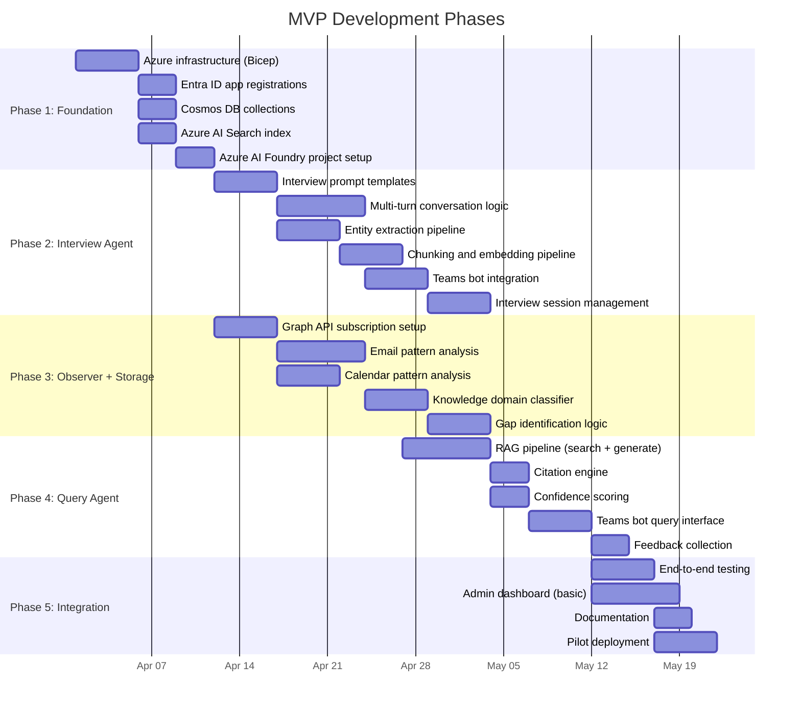

# MVP Implementation Plan

This plan provides phased, actionable specifications for building a minimum viable product of the Knowledge Transfer Agent. Each phase is designed to be independently deployable and valuable.

## MVP Scope

The MVP focuses on the core knowledge capture → query loop:

1. ✅ **Interview Agent** — Structured knowledge capture via Teams
2. ✅ **Basic Observer** — Graph API analysis of email/calendar patterns
3. ✅ **Knowledge Storage** — Azure AI Search + Cosmos DB
4. ✅ **Query Agent** — RAG-based Q&A via Teams bot
5. ❌ Digital Coworker (Phase 2+)
6. ❌ M365 Copilot Plugin (Phase 2+)
7. ❌ Full relationship mapper (Phase 2)

## Phase Overview

## Technical Stack for MVP

| Component | Technology | Justification |
|-----------|-----------|---------------|
| **Runtime** | Node.js 20+ with TypeScript | Strong Azure SDK support, Bot Framework SDK |
| **Infrastructure** | Bicep (Azure IaC) | Native Azure, simpler than Terraform for Azure-only |
| **Agent Framework** | Azure AI Foundry SDK | Built-in tool use, conversation management |
| **Bot Framework** | Bot Framework SDK v4 + Teams AI Library | Production Teams bot patterns |
| **Data Pipeline** | Azure Functions (Node.js) | Event-driven, serverless, cost-effective |
| **LLM** | Azure OpenAI GPT-4o | Best quality for interview + query agents |
| **Embeddings** | Azure OpenAI text-embedding-3-large | High-quality vectors, 3072 dimensions |
| **Search** | Azure AI Search (S1) | Hybrid vector + keyword with semantic ranking |
| **Database** | Azure Cosmos DB (Serverless) | NoSQL + Gremlin, pay-per-use |
| **Identity** | Microsoft Entra ID + MSAL | Enterprise SSO, Managed Identity |
| **Monitoring** | Application Insights | Native Azure telemetry |

## Phase Details

Detailed specifications for each phase are in the following documents:

| Phase | Document | Description |
|-------|----------|-------------|
| 1 | [Phase 1: Infrastructure](phase-1-extraction.md) | Azure resource provisioning and base configuration |
| 2 | [Phase 2: Storage & Search](phase-2-storage-search.md) | Cosmos DB, AI Search, and processing pipeline |
| 3 | [Phase 3: Query Agent](phase-3-query-agent.md) | RAG pipeline, Teams bot, and feedback loop |

## Coding Agent Instructions

This MVP plan is designed to be executable by a coding agent (e.g., GitHub Copilot, Cursor). Each phase document includes:

- **Specific file paths** to create
- **Code structure** with module boundaries
- **Configuration schemas** with example values
- **Test criteria** for validation
- **Dependencies** between components

### Recommended execution order for a coding agent:

1. Read all phase documents first to understand the full picture
2. Start with Phase 1 (infrastructure) — this creates the Azure resources
3. Implement Phase 2 (interview agent) and Phase 3 (observer) in parallel
4. Implement Phase 4 (query agent) after Phase 2's storage pipeline is working
5. Phase 5 (integration) ties everything together

### Key conventions:

- All code in TypeScript (strict mode, ES2022, NodeNext)
- ES module imports with `.js` extensions
- Vitest for testing
- Environment variables for all configuration (no hardcoded secrets)
- Structured logging via Application Insights SDK
